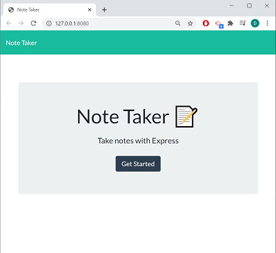
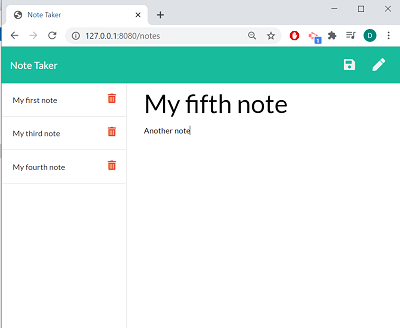
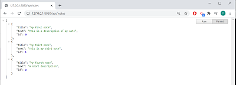

# 11-Note_Taker

 <a href="https://img.shields.io/badge/node-v12.19.0-orange?style=plastic"></a>
<a href="https://img.shields.io/badge/express-v4.16.4-blue?style=plastic"></a>
<a href="https://img.shields.io/badge/heroku-v7.47.11-yellow?style=plastic"></a>
 <a href="https://img.shields.io/badge/License-MIT-brightgreen?style=plastic"></a>  

---

## Description
This app can be used to write, save, and delete notes. It will use an [express](https://www.npmjs.com/package/express) backend and save and retrieve note data from a JSON file.  

The following HTML routes should be created:  
  * GET `/notes` - Should return the `notes.html` file.  
  * GET `*` - Should return the `index.html` file.  
The application should have a `db.json` file on the backend that will be used to store and retrieve notes using the `fs` module.  
The following API routes should be created:  
  * GET `/api/notes` - Should read the `db.json` file and return all saved notes as JSON.  
  * POST `/api/notes` - Should receive a new note to save on the request body, add it to the `db.json` file, and then return the new note to the client.  
  * DELETE `/api/notes/:id` - Should receive a query parameter containing the id of a note to delete. To do this, each note should have a unique `id` when it's saved. When a note needs to be deleted, all notes from the `db.json` file should be checked and the note with the given `id` property should be removed. Then all the notes should be rewriten to the `db.json` file.  


:information_source:  

```
User Story Acceptance Criteria
```
```
AS A user, I want to be able to write, save notes and delete notes
SO THAT I can organize my thoughts and keep track of tasks I need to complete  
WHEN I run the application,
THEN I can create and save notes
WHEN some notes were previously saved, 
THEN I can view them or delete them.

```


## Table of Contents  

* [Installation and Usage](#Installation-and-Usage)  
* [Images of the app](#Images-of-the-app-) 
* [License](#License)  
* [Contact](#Contact) 


## Installation and Usage  

- You can run the Heroku deployed app directly by clicking on this [link](). 


- To install without using the deployed app, follow the below steps: 
  - Open a terminal instance  
  - Clone the following [repo](https://github.com/Delph-Sunny/11-Note_Taker)  
  - In the working directory, install the dependencies package, Inquirer and Jest with the following code line `npm i`  
  - Once the dependencies have been installed, enter `npm run watch`  
  - Click on the [PORT url](http://127.0.0.1:8080) displayed to launch the app.
  

## Images of the app :mag:  
Launched app:  
  

Adding notes:  


The api after removing note #2:  
  

## License  

Copyright (c) 2021 DT.  
This project is [MIT](https://choosealicense.com/licenses/mit) licensed.

## Contact  

:octocat:  GitHub: [Delphine](https://github.com/Delph-Sunny)  


---